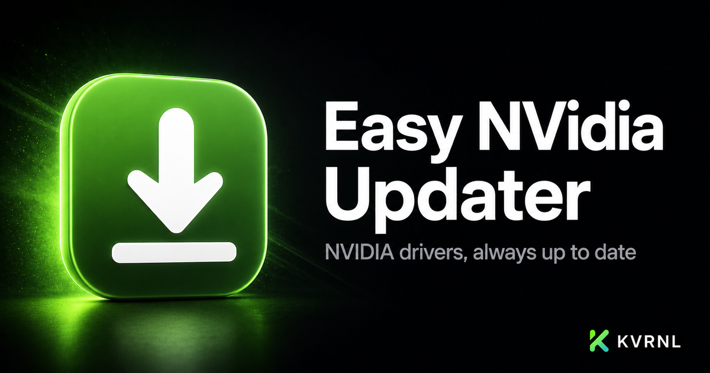

# Easy NVidia Updater

### NVIDIA drivers, always up to date — quietly

 

A lightweight tray app that auto-detects your NVIDIA GPU and keeps its drivers current — installs silently in the background or notifies you first. No GeForce Experience, no accounts, no trips to the website.

### **[⬇&nbsp; Download Easy NVidia Updater — free at kvrnl.io](https://kvrnl.io/products/easy-nvidia-updater/)**

 

---

## What it does

Easy NVidia Updater does one thing impeccably: it keeps your NVIDIA drivers up to date. It detects your GPU automatically — single, dual, desktop or laptop — with zero model-picking, checks NVIDIA daily or weekly for a newer Game Ready or Studio driver, and gets it installed cleanly (driver only, none of the GeForce Experience bloat).

Choose how it works: fully automatic silent installs in the background, or a quick notification so you can install with one click. It lives in your system tray and stays out of the way. Free to use; claim your license key and download it straight from this page.

## Features

- **Automatic GPU detection — no model-picking, ever**
- **Silent background installs, or notify-then-click — your choice**
- **Latest Game Ready or Studio drivers, checked daily or weekly**
- **Clean driver-only install — skips the GeForce Experience bloat**

## Download &amp; install

Easy NVidia Updater is **completely free**. Downloads run through a free KVRNL account so every
install gets its own license key.

1. Go to **[kvrnl.io/products/easy-nvidia-updater/](https://kvrnl.io/products/easy-nvidia-updater/)**
2. Create a free account — email verification, nothing else
3. Claim your license key — instant, no waiting
4. Download and install

> [!NOTE]
> Easy NVidia Updater isn't code-signed yet, so Windows SmartScreen may warn you on first run.
> Click **More info → Run anyway**. Code signing is on the roadmap.

## Your license key

- **Free, one per product**, issued from your KVRNL account.
- **A key activates on one machine.** The first device to activate it claims it.
- **Switching computers?** Hit **Release device** on your
  [account page](https://kvrnl.io/account/) and the key is free to use again.
- Keys are checked over HTTPS at launch. See [Privacy](#privacy).

## Requirements

- **Windows 10 or 11** (64-bit)
- A free [KVRNL account](https://kvrnl.io/signup/) for your license key

## Privacy

Easy NVidia Updater sends KVRNL only what's needed to validate your license: **the key, the
product name, and a hardware ID**. No telemetry, no analytics, no tracking, and
none of your files. Full policy: **[kvrnl.io/privacy](https://kvrnl.io/privacy/)**

## What's new

**v1.0.7** — 2026-09-25
  - Pin the tray panel anywhere: grab it by the top and drag it wherever you like, and it pins itself there. You can also press the pin button in its corner.
  - A pinned panel stays open and stays exactly where you put it, even after restarts and updates, until you unpin it.
  - Unpin with the same button and it goes back to being a normal pop-up above the tray icon.
  - Right-clicking the tray icon now opens the same panel as left-clicking, instead of a separate menu. Double-click still opens the full app.

**v1.0.6** — 2026-09-25
  - New tray popup: click the tray icon for a mini control center that opens right above it, instead of the full window.
  - At a glance it shows whether your driver is up to date, your GPU, the installed and latest versions, and when it last checked, with one button to check or install.
  - Two quick switches right in the popup: Auto-install and Studio drivers.
  - Open app and Settings buttons take you straight to the full window, on the right tab. Double-clicking the tray icon still opens the full app.
  - The popup closes when you click anywhere else, and shows download progress live while a driver installs.
  - The app now shows 'Checking with NVIDIA…' while a check is running, and pressing Check now during a check waits for that same check instead of doing nothing.

**v1.0.5** — 2026-09-05
  - A complete redesign. The app is now organised into five clear tabs: Overview, Settings, History, Support and About.
  - Overview puts everything that matters on one screen: a big status indicator, your GPU, installed and latest driver versions, when it last checked, and one clear button.
  - Settings are now plain-English choice cards that explain what each option does, plus proper toggles for Launch at login and Clean install. Every change still saves instantly.
  - History has its own tab with the full record of installs.
  - The sidebar shows your driver status at a glance and marks Overview with a dot when an update is waiting.
  - The window is a little wider to fit the new layout, and remembers which tab you were on.

**v1.0.4** — 2026-09-05
  - Driver notifications now actually show up on Windows. A missing app identity setting meant the alerts from 'Notify me' mode were being silently dropped.
  - If a check can't complete (no internet, or Windows still waking up after boot), the app now retries within the hour instead of waiting until the next day or week.
  - More patience on slow machines and connections: GPU detection and the NVIDIA lookup wait longer before giving up, so a slow start no longer reads as 'No NVIDIA GPU detected'.
  - Automatic mode no longer re-downloads and retries the same failed driver every day. After a failed attempt it notifies you instead and lets you retry with one click, then resumes on its own after three days.
  - No more pop-up notification when you already have the window open.
  - Fixed the activation screen firing twice if you pressed Enter while a key was still being checked.

**v1.0.3** — 2026-09-02
  - The app now installs its own updates. Before, an update could download and then wait indefinitely because the app lives in the tray and is never closed. It now installs quietly when idle, or notifies you if you have the window open so you can pick the moment.
  - Added the newest NVIDIA cards: GeForce RTX 5060, RTX 5050 and RTX 5090 D v2 on desktop, and the RTX 5070, RTX 5060 and RTX 5050 laptop GPUs. Owners of these previously saw 'couldn't match your GPU'.
  - A driver download that stops receiving data no longer hangs the install. It fails cleanly after 90 seconds and you can retry.
  - Fixed the app reporting 'admin approval cancelled' too early when you took more than a minute to answer the Windows prompt, which could let the install run in the background without the app knowing.
  - Small cleanups: leftover install-queue files are removed, and a settings hint that could get stuck on an error message now resets.

Full history → **[kvrnl.io/changelog/easy-nvidia-updater](https://kvrnl.io/changelog/easy-nvidia-updater/)**

## Documentation

Setup guides and how-tos → **[kvrnl.io/docs/easy-nvidia-updater](https://kvrnl.io/docs/easy-nvidia-updater/)**

## Support

> [!IMPORTANT]
> **We don't use GitHub Issues.** Report bugs from inside the app — it's the
> fastest route to us and it attaches the details we need automatically.

- 🐛 **Found a bug?** Use **Report a Problem** inside Easy NVidia Updater
- 💬 **Chat with us** → **[Discord](https://discord.gg/Ub4SdAuhu)**
- ✉️ **Anything else** → **[kvrnl.io/contact](https://kvrnl.io/contact/)**
- ❓ **FAQ** → [kvrnl.io/faq](https://kvrnl.io/faq/)

## License

**Proprietary freeware — free to use, not open source.**

This repository hosts the installer releases, documentation, and license for
Easy NVidia Updater. **The application source code is not published.** See
**[LICENSE](./LICENSE)** for the full terms.

---

 

**[kvrnl.io](https://kvrnl.io)** &nbsp;·&nbsp; **[All products](https://kvrnl.io/products/)** &nbsp;·&nbsp; **[Changelog](https://kvrnl.io/changelog/)** &nbsp;·&nbsp; **[Discord](https://discord.gg/Ub4SdAuhu)** &nbsp;·&nbsp; **[Contact](https://kvrnl.io/contact/)**

© 2026 <b>KVRNL</b> — an AI-powered software studio shipping free desktop tools.

